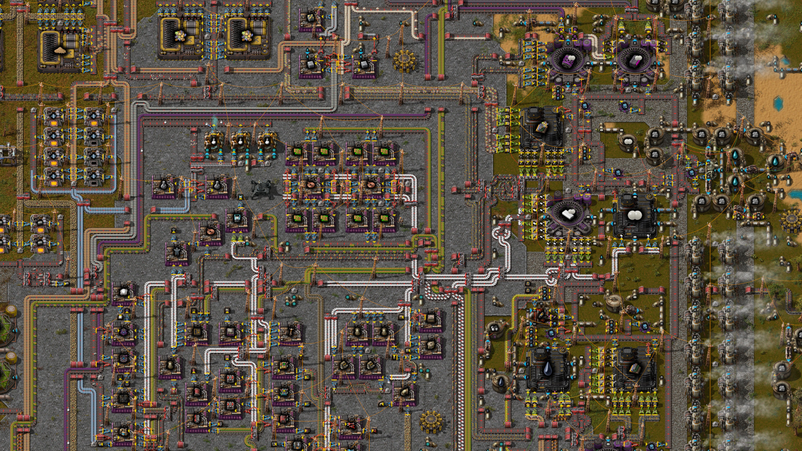

An overhaul mod for Factorio featuring:
* Completely new tech tree and recipes.
* Unique logistic challenges and assorted devious automation puzzles.
* Six tiers of science and a different endgame goal.
* Multiplayer compatibility.

## Overview

This is a mod that makes Factorio significantly more difficult, but in a way that should feel fairly unique.

The player starts with a single extremely useful cube (additional copies cannot be crafted), required as a catalyst in various large bulk-processing steps.

As a result, substantial portions of the factory resist copy-paste expansion, and can be made more efficient only by solving logistical problems, making design improvements, or unlocking new technologies.

At any given level of technological progress, there will exist some theoretical upper bound on the potential output of your factory. Getting close to the limit will be tricky: you'll need to set up automation to intelligently route the cube where it's needed, deal with sporadically-running high-throughput machines, and probably invest in a fair amount of circuit network trickery.

There aren't huge numbers of intermediate products or incredibly involved recipe chains. There's more fluid and byproduct handling, but hopefully nothing masochistic. Additional complexity and difficulty lies mostly in logistics and macro-level interactions.

The technology tree has been rebuilt from scratch. Some production chains share similarities with vanilla equivalents, but there's usually some kind of twist. Several traditional staples are absent.

The aim is to have roughly comparable scope to the base game in terms of raw volume of content, but to frequently present new and interesting challenges.

## You might like this mod if:

* You're open to a very different take on the Factorio experience.
* You enjoy solving automation and logistic puzzles, monitoring and iterating on complex setups which probably won't be perfect first try.
* You like the idea of a dynamic factory, with different sections that turn on at different times, and not every belt tends towards either completely empty or completely backed-up.
* You want an excuse to experiment with Factorio's core mechanics in unusual ways.
* You appreciate Rube Goldberg machines.

## You might not like this mod if:

* You're looking for a "vanilla plus" experience.
* You need compatibility with other large/overhaul mods.
* You can't live without the ability to scale up a base arbitrarily. While there are still benefits in going big, in this mod you can't always just stamp down more production.
* You're not willing to experiment at least a little bit with combinators and circuit conditions.
* The idea of being unable to calculate exact throughput numbers for production chains sounds horrifying.

# Screenshots

Relatively early-game spaghetti.

# FAQ

* **Where are the biters?** Currently, there are no military technologies and biters are disabled. This decision might be revisited later.

* **Where are all the technologies?** Most technologies are hidden at the start of the game. The technology tree will expand as you gain access to new levels of science.

* **So do I have to manually hand-feed this cube all the time or what?** You will likely need to do a few things manually in the short early-game section. Technologies will soon allow for automation.

* **Can I really automate this?** Everything can be automated, and there is probably more than one way to do it.

* **I lost my cube!** Its location will show up on the minimap. If you somehow manage to destroy the cube and the game can't find it, you'll see a warning message. In that case please file a bug report.

* **My factory isn't producing enough, how can I improve it?** The main production bottleneck will always be processes that require the cube as a catalyst. At most one of these steps can be running at any given time. Try to think of ways to get the most use out of it per unit of time and ensure it never gets stuck anywhere. Look in the technology tree for things that could help.

* **Bulk-processing machines sometimes won't accept ingredients even though it seems like they should.** This is an [issue with Factorio's assembling machine logic](https://forums.factorio.com/viewtopic.php?f=7&t=101436). It seems that it will be fixed with the DLC release. Until then, you'll just have to work around it. (This bug is also the reason productivity modules aren't allowed in cube-powered recipes: bonus outputs block progress, get the cube stuck and make things worse.)

# Compatibility

This is an overhaul mod that removes many standard ingredients and entities from the game. It's unlikely to be compatible with other mods that haven't been specifically adapted to work with it, unless they don't depend on any vanilla items or entities. Simple mods like Far Reach or Even Distribution should work fine.

There is currently built-in support for the following optional mods:

* [Flow Control](https://mods.factorio.com/mod/Flow%20Control) for assorted one-way valves
* [Nixie Tubes](https://mods.factorio.com/mod/nixie-tubes) for displaying circuit network values
* [Pushbutton](https://mods.factorio.com/mod/pushbutton) for manual input of circuit signals
* [Picker Dollies](https://mods.factorio.com/mod/PickerDollies) for easily rearranging combinators without disconnecting circuit wires (gently recommended)
* [Textplates](https://mods.factorio.com/mod/textplates) for annotating your factory

[AAI Loaders](https://mods.factorio.com/mod/aai-loaders) is also a integrated as a required dependency.

If you would like to contribute/request support for compatibility with some other mod, you are welcome to open a pull request or github issue.

# Dependencies and credits

This mod depends on [Krastorio2Assets](https://mods.factorio.com/mod/Krastorio2Assets) for additonal graphics and sounds. It doesn't depend on the [Krastorio2 code](https://mods.factorio.com/mod/Krastorio2) itself, but contains modified versions of some of its prototype definitions. Both mods are licensed under the GNU GPLv3. I am very grateful to the Krastorio 2 team, since this mod wouldn't have happened without their work.