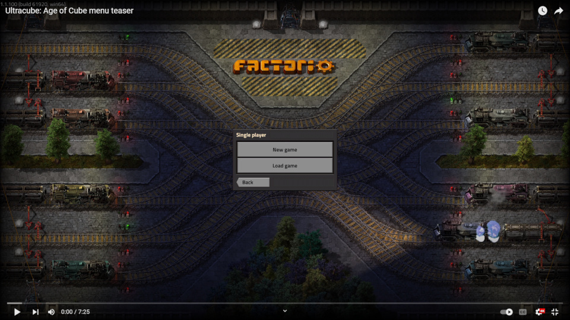

An overhaul mod for Factorio featuring:
* Completely reworked tech tree and recipes.
* Unique logistic challenges and assorted devious automation puzzles.
* Six tiers of science and a new endgame goal.
* Multiplayer compatibility.

There is a [discord you can join here](https://discord.gg/GAvypzwyWU).

## Contents

* [Overview](#overview)
  * [You might like this mod if...](#you-might-like-this-mod-if)
  * [You might not like this mod if...](#you-might-not-like-this-mod-if)
  * [Comparison to other overhaul mods](#comparison-to-other-overhaul-mods)
  * [Development status and roadmap](#development-status-and-roadmap)
  * [Translation](#translation)
* [Compatibility](#compatibility)
  * [List of compatible mods](#list-of-compatible-mods)
  * [Compatibility guide for modders](#compatibility-guide-for-modders)
* [FAQ](#faq)
* [Dependencies and credits](#dependencies-and-credits)

# Overview

Sure, it's nice if the factory grows. But in this mod the factory must also be _optimized_.

The player starts with a single extremely useful cube (additional copies cannot be crafted), required as a catalyst in various large bulk-processing steps. Everything from research to power generation ultimately depends on it.

Because of this, substantial portions of the factory cannot be scaled up with simple copy-paste expansion. Instead, they can be made more efficient only by solving logistical problems, making design improvements, or unlocking new technologies.

At any given level of technological progress, there will exist some theoretical upper bound on the potential output of your factory. Getting close to the limit will be tricky: you'll need to set up automation to intelligently route the cube where it's needed, deal with sporadically-running high-throughput machines, and probably invest in a fair amount of circuit network trickery.

The technology tree has been carefully rebuilt from scratch to fit, and there are a few new tools to play with, too.

## You might like this mod if...

* You like the "optimization problem" aspect of Factorio, enjoy solving automation and logistic puzzles, and monitoring and iterating on complex setups which probably won't be perfect first try.
* You like the idea of a dynamic factory, with different sections that turn on at different times, and not every belt tends towards either completely empty or completely backed-up.
* You want an excuse to experiment with Factorio's core mechanics in unusual ways.
* You appreciate Rube Goldberg machines.

## You might not like this mod if...

* You're looking for a "vanilla plus" experience.
* You need compatibility with other large or overhaul mods.
* You can't live without the ability to scale up production arbitrarily. (There are still benefits in going big, and ways to do so, but you can't always just stamp down more machines in the usual way.)
* You're not willing to experiment at least a little bit with combinators and circuit conditions.

## Comparison to other overhaul mods

In terms of raw volume of content, Ultracube aims for a comparable scope to the base game.

As for difficulty, it's trickier to compare. Ultracube mostly avoids the long, complicated recipe chains with many intermediate products often found in overhaul mods. There are only a handful of raw resources, and many recipes are fairly simple. There's a bit more fluid and byproduct handling, but nothing masochistic.

Instead, additional complexity comes largely from logistics and macro-level interactions. Even when recipes are simple, it'll be difficult to make them all run efficiently together. Other processes might need a bit of careful planning or lateral thinking to get working at all, even if they only have a few steps.

Progression should be relatively clear, without too much hunting around in the tech tree for what's next, while frequently presenting new and interesting challenges.

The overall feel is probably closer to something like Freight Forwarding (but maybe a bit more radical) than other overhauls.

## Development status and roadmap

The mod is more or less feature-complete, but should still be considered a beta at this point. Especially the latter half or so will likely be subject to balancing passes after further playtesting (feedback is welcome).

Planned improvements include:

* Compatibility with more optional mods.

See the [mod portal changelog](https://mods.factorio.com/mod/Ultracube/changelog) for version history.

## Translation

Translation is handled via this [CrowdIn project](https://crowdin.com/project/factorio-mods-localization) under `Factorio Ultracube`. You can find more details [here](https://github.com/dima74/factorio-mods-localization#how-to-translate-using-crowdin).

# Compatibility

This is an overhaul mod that removes most standard resources, ingredients, technologies and entities from the game.

As you might expect, compatibility with other large overhaul mods that make their own drastic changes to the technology tree is unlikely.

Quality-of-life mods without new technologies or recipes like [Far Reach](https://mods.factorio.com/mod/far-reach) or [Even Distribution](https://mods.factorio.com/mod/even-distribution) should mostly work just fine.

Mods that add new recipes or technologies must be specifically adapted to work with Ultracube. Technologies need to be changed to fit into the Ultracube tech tree with appropriate prerequisites, and be researched with Ultracube science cards. Recipes need to be changed to have Ultracube ingredients. Support can be added with either conditional logic in Ultracube code to check for the presence of the other mod and make the necessary adjustments, or the other way around.

Mods that teleport, create, destroy or otherwise mess with items and machines via script also have the potential to cause issues. This could either be by allowing for some way to accidentally destroy an irreplaceable item (something that's otherwise carefully guarded against), or by interfering with the optimized caching logic that Ultracube uses to track the current location of such items (necessary for UX and technical reasons) in a UPS-friendly manner.

Mods that move the player to other surfaces or allow creating additional cubes for testing, like Blueprint Designer or Editor Extensions, are currently not well-supported. This should be fixed at some point.

Regardless of technical obstacles, practical considerations could make some other mods a poor match. Ultracube imposes unusual constraints and is designed and balanced with those in mind. Combining it with mods that provide ways around those constraints could easily result something that doesn't make a whole lot of sense (but you do you).

## List of compatible mods

The following mods have been adapted to work with Ultracube:

| Mod | Notes |
| --- | ----- |
| [AAI Loaders](https://mods.factorio.com/mod/aai-loaders) | integrated as standard (required dependency) |
| [AAI Signal Transmission](https://mods.factorio.com/mod/aai-signal-transmission) | |
| [Better Victory Screen](https://mods.factorio.com/mod/better-victory-screen) | |
| [Circuit HUD V2](https://mods.factorio.com/mod/CircuitHUD-V2) | |
| [Compact Circuits](https://mods.factorio.com/mod/compaktcircuit) | |
| [Display Plates](https://mods.factorio.com/mod/DisplayPlates) | |
| [Flow Control](https://mods.factorio.com/mod/Flow%20Control) | |
| [Holographic Signs](https://mods.factorio.com/mod/holographic_signs) | |
| [Inventory Sensor](https://mods.factorio.com/mod/Inventory%20Sensor) | simplifies some challenges, not essential |
| [Milestones](https://mods.factorio.com/mod/Milestones) | |
| [Nixie Tubes](https://mods.factorio.com/mod/nixie-tubes) | [Alternative](https://mods.factorio.com/mod/SantasNixieTubeDisplay) [forks](https://mods.factorio.com/mod/UPSFriendlyNixieTubeDisplay) are also supported |
| [Pushbutton](https://mods.factorio.com/mod/pushbutton) | |
| [Picker Dollies](https://mods.factorio.com/mod/PickerDollies) | helpful for tweaking combinator layouts |
| [Project Cybersyn](https://mods.factorio.com/mod/cybersyn) | [Cybersyn Combinator](https://mods.factorio.com/mod/cybersyn-combinator) is also supported |
| [Recursive Blueprints](https://mods.factorio.com/mod/recursive-blueprints) | [Recursive Blueprints+](https://mods.factorio.com/mod/rec-blue-plus) is also supported |
| [Safe Waterfill](https://mods.factorio.com/mod/safefill) | |
| [Spidertron Logistics System](https://mods.factorio.com/mod/spidertron-logistics) | |
| [Stack Combinator](https://mods.factorio.com/mod/stack-combinator) | |
| [Textplates](https://mods.factorio.com/mod/textplates) | |
| [Tiny Assemblers](https://mods.factorio.com/mod/tiny-assemblers) | |
| [Wire Shortcuts](https://mods.factorio.com/mod/WireShortcuts) | |

This list is expected to grow with time. You can submit a pull request, github issue or mod portal comment if you'd like to see compatibility with some other mod in particular.

## Compatibility guide for modders

See the [dedicated compatibility page here](https://github.com/grandseiken/factorio-ultracube/blob/main/COMPATIBILITY.md).

# FAQ

| Q | A |
| - | - |
| **How can I make my mod compatible with Ultracube?** | See the [compatibility guide](https://github.com/grandseiken/factorio-ultracube/blob/main/COMPATIBILITY.md). |
| **Can I help translate this mod?** | Yes, translation is handled via this [CrowdIn project](https://crowdin.com/project/factorio-mods-localization) under `Factorio Ultracube`. More details [here](https://github.com/dima74/factorio-mods-localization#how-to-translate-using-crowdin). |
| **Where are the biters?** | Currently there are no military technologies and biters are disabled. This was mostly to prioritise releasing a playable version without needing to integrate and balance military. Biters might get reintroduced as an optional extra at some point. |
| **Where are all the technologies?** | Most technologies are hidden at the start of the game. The technology tree will expand as you gain access to new levels of science. |
| **I can't seem to get started at all.** | You should start with a couple of machines (a synthesizer and a fabricator). If you don't have these, make sure you started Freeplay mode rather than a scenario. Also make sure that your character is capable of crafting the basic matter unit recipe while holding the cube. If not, you might be using a custom character mod that's somehow incompatible. |
| **Is this a Krastorio 2 extension?** | Ultracube depends only on [Krastorio2Assets](https://mods.factorio.com/mod/Krastorio2Assets) for some additional graphics and sounds (see [credits](#dependencies-and-credits)). It's otherwise separate and doesn't share any technologies or recipes with Krastorio 2. |
| **So do I have to manually hand-feed this cube all the time, or what?** | You will likely need to do a few things manually in the short early-game section. Technologies will soon allow for automation. |
| **Can I really automate this?** | Everything can be automated, and there is probably more than one way to do it. |
| **I lost my cube!** | Its location will show up on the minimap. You can also press K (by default) to open the cubecam. If you somehow manage to destroy the cube and the game can't find it, you'll see a warning message. In that case please file a bug report. |
| **My factory isn't producing enough, how can I improve it?** | The main production bottleneck will always be processes that require the cube as a catalyst. At most one of these steps can be running at any given time. Try to think of ways to get the most use out of it per unit of time and ensure it never gets stuck anywhere. Look in the technology tree for things that could help. |
| **Bulk-processing machines sometimes won't accept ingredients even though it seems like they should.** | This is an [issue with Factorio's assembling machine logic](https://forums.factorio.com/viewtopic.php?f=7&t=101436). It seems that it will be fixed with the DLC release. Until then, you'll just have to work around it. (This bug is also the reason productivity modules aren't allowed in cube-powered recipes: bonus outputs block progress, get the cube stuck and make things worse.) |

# Dependencies and credits

This mod depends on [Krastorio2Assets](https://mods.factorio.com/mod/Krastorio2Assets) for additional graphics and sounds. It doesn't depend on Krastorio 2 code itself, but contains modified versions of some of its prototype definitions. Both mods are licensed under the GNU GPLv3. I am extremely grateful to the Krastorio 2 authors, since this mod wouldn't have happened without their work.
